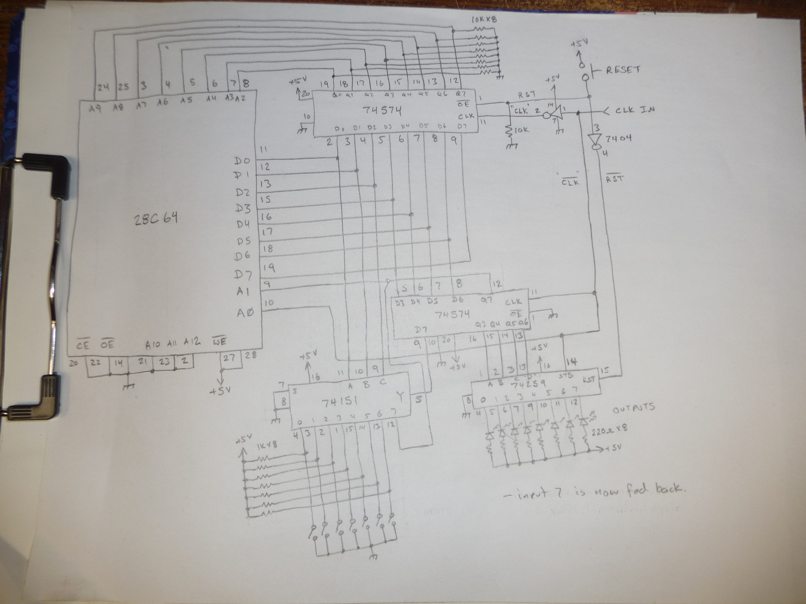

#  1 bit ROM based controller
   

   
 Based on https://laughtonelectronics.com/Arcana/One-bit%20computer/One-bit%20computer.html

I'm trying to convert this to markdown, in the meantime the formatting is badly broken, sorry.

---

## Features
- Every 32 bit instruction is single cycle.
- it can do like a lot of MIPS.
- Tips out at over 4MHz, thats faster than a 6502!
- 7 one bit user inputs
- 7 one bit user outputs
- System halted output.
- 41 powerfully psychedelic instructions
- Simple hardware architecture using high-availability components.
- A flag register.
- None of those bothersome interrupt things.
- Programmable with up to 256 instructions.
- Completely stack overflow protected, by not having a stack.


  
---

## Compiling the assembler
``` 
  To compile the assembler:  gcc *.c -o 1bit-as
  To assemble with it:  1bit-as test1.asm
    (output is in output.bin)
  To burn with minipro to a 28C64 eeprom: 
    (minipro -p AT28C64 -s -w output.bin)
```     

## Compiling the uploader
```
  To compile the uploader: gcc *.c -o 1bit-dude
  To upload with it:  1bit-dude -p /dev/ttyUSB0 -f output.bin
```

---

## Coding
- Use uppercase
- Don't put instructions on lines with labels
- There are no actual commas, 
  SETBJMP 4 JUMPDEST
- See examples and test programs.  
- The reset vector is 0x00.

---

## Programming
  On the basic hardware, you will need to use a pre-programmed memory chip.
  If you are using the version with the serial upload option, the uploader software can 
  write your binary to a SRAM or 28Cxx Series of eeprom in the system. (no special firmware is required on the 1-bit)
   (1bit-dude -p /dev/ttyUSB28 -f wooble.bin)

---

## Constructing
  There are a few flavours of the hardware.
  
  
  Basic system:

  
  
  System with serial upload:

  
---
 
## Using
So what can a 1 bit computer be used for?
* It can be used as a simple PLC
* Serial is 1 bit, so it can do that...

 
---
  Questions?
    
``` twitter @ruenahcmohr ```

---  
  
``` 
ThisIsALabel:

; This is a comment

NAME EQU VALUE

  where value is either a number, or the name of something previously defined. (SINGLE EQU ONE)
  example: PI EQU 3
  no equations or math or junk, just values.
  
NAME EQU

   delete value 'name'
```   

---

           ** By reading this you are responsible for any mental damage 
                  caused by trying to understand this instruction set. **


## Instructions

  This machine only actually has one micro instruction. 
  
  Effectivly, for the purposes of programming the following occurs:
 - The output is written
 - An input is read to the F register
 - An address is jumped to (which one depending on the F register)
 

   Machine Instruction:

```
      if F false: [ I, O ] [ jump ]  
      if F true:  [ I, O ] [ jump ] 
```

  Order of operations:
 -    (latch outputs, read inputs), jump
 -    The value output depends on the status of the F register from the previous instruction.
 -    The value of the F register after the read determines the jump performed.

---

## Instruction summary
```
Where:
 a  8 bit address          
 i  3 bit input address    
 o  3 bit output address   
 v  1 bit value            
```


  -- machine set
```
  NOP             
  HALT  
```
  -- mostly I/O set
```
  SETB      o       
  SETBJMP   o, a  
  SETBSKIP  o
  CSETB     o, o  
  CSBFS     o
  CSBFC     o

  CLRB      o       
  CLRBJMP   o, a      
  CLRBSKIP  o
  CCLRB     o, o
  CCBFS     o
  CCBFC     o  

  OUTIN     o, i
  OUTINJMP  o, i, a 
  OUTV      o, v
  OUTVJMP   o, v, a
  OUT       o
  OUTI      o
  OUTIJMP   o, a
  OUTJMP    o, a
  COUTF     o, v, o, v
  COUTFS    o, v
  COUTFC    o, v

  IN        i
  INJMP     i, a
  INJPS     i, a
  INJPC     i, a
  CINF      i, i
```
  -- mostly flow control set
```
  JMP       a     
  JPS       a       
  JPC       a   
  JMPT      a 
  
  JPV       v, a
  JPNV      v, a
  
  JPIV      i, v, a
  JPINV     i, v, a

  FORKF     af, at
  FORKI     i, af, at

  WAITIS    i
  WAITISJMP i, a  
  WAITIC    i  
  WAITICJMP i, a

  SKIPIC    i
  SKIPIS    i

  SKIPFC   
  SKIPFS  

  REPTIC    i
  REPTIS    i

  REPTFC   
  REPTFS   
```  
  -- math / ALU instructions
```  
   
```

---
  
  
   Flag modified / output modified.

|           |   F   |  Output |    Cycles |
| -         | -     | -       | -         |
| REPTFC    |       |         |     1     |    
| REPTFS    |       |         |     1     |
| SKIPFC    |       |         |     1     |    
| SKIPFS    |       |         |     1     |
| FORKF     |       |         |     1     |
| NOP       |       |         |     1     |
| HALT      |       |         |    inf    |         
| JMP       |       |         |     1     |    
| JMPT      |       |         |     1     |    
| JPS       |       |         |     1     |    
| JPC       |       |         |     1     |    
| JPV       |       |         |     1     |    
| JPNV      |       |         |     1     |
|           |       |         |           |
| SETB      |       |    Y    |     1     |    
| SETBJMP   |       |    Y    |     1     | 
| SETBSKIP  |       |    Y    |     1     |    
| CSETB     |       |    Y    |     1     |    
| CSBFS     |       |    M    |     1     |    
| CSBFC     |       |    M    |     1     |    
| CLRB      |       |    Y    |     1     |    
| CLRBJMP   |       |    Y    |     1     |    
| CLRBSKIP  |       |    Y    |     1     |    
| CCLRB     |       |    Y    |     1     |                        
| CCBFS     |       |    M    |     1     |    
| CCBFC     |       |    M    |     1     |    
| OUTV      |       |    Y    |     1     |    
| COUTVFS   |       |    M    |     1     |    
| COUTVFc   |       |    M    |     1     | 
| OUTVJMP   |       |    Y    |     1     |    
| OUT       |       |    Y    |     1     |    
| OUTI      |       |    Y    |     1     |    
| OUTIJMP   |       |    Y    |     1     |    
| OUTJMP    |       |    Y    |     1     |    
| COUTF     |       |    Y    |     1     |                     
|           |       |         |           |
| IN        |   Y   |         |     1     |    
| INJMP     |   Y   |         |     1     |    
| INJPS     |   Y   |         |     1     |    
| INJPC     |   Y   |         |     1     |    
| CINF      |   Y   |         |     1     |                         
| JPIV      |   Y   |         |     1     |    
| JPINV     |   Y   |         |     1     |                       
| FORKI     |   Y   |         |     1     |    
| WAITIS    |   Y   |         |     -     |    
| WAITISJMP |   Y   |         |     -     |    
| WAITIC    |   Y   |         |     -     |    
| WAITICJMP |   Y   |         |     -     |    
| SKIPIC    |   Y   |         |     1     |    
| SKIPIS    |   Y   |         |     1     |                      
| REPTIC    |   Y   |         |     1     |    
| REPTIS    |   Y   |         |     1     |                        
|           |       |         |           |
| OUTIN     |   Y   |    Y    |     1     |    
| OUTINJMP  |   Y   |    Y    |     1     |
                                       
                                      
  M = maybe (conditional)
 

===================================================================

## Instruction set details

 The format of these instruction details is as follows:
```  
Instruction_name
    if F false: Bit read to F register, Output operation performed*, address jumped to
    if F true:  Bit read to F register, Output operation performed*, address jumped to

    detailed description of instruction.
```

*The output operation depends on the old F value, not the new one.*

```
 F is the flag register. (data bus)
 A is the 'current address'
 NC is the No Connect output (used to indicate if the system has halted)
 Input 7 is the loopback input. Reading this will not modify the F register.

 arguments:
 
 a: 8 bit address
 i: 3 bit input
 o: 3 bit output
 v: 1 bit value
```
---
```
NOP    
  test 7, set NC, jump A+1
  test 7, set NC, jump A+1

  No operation, machine is idle for 1 cycle.
  1 is written to the NC output
```      
-------------------------------------------------------------------------
```
HALT
  test 7, clear NC, jump A
  test 7, clear NC, jump A

  Halt machine.
  Reset is the only escape
  0 is written to the NC output (machine halts by looping this instruction)    
 ```   
-------------------------------------------------------------------------
```
SETB o
  test 7, set o, jump A+1
  test 7, set o, jump A+1

  (set bit)
  Set output bit o
```
-------------------------------------------------------------------------
```
SETBSKIP o
  test 7, set o, jump A+2
  test 7, set o, jump A+2

  (set bit, skip)
  Set output bit o, skip next instruction
```
-------------------------------------------------------------------------
```
CSBFS o
  test 7, set NC , jump A+1
  test 7, set o, jump A+1

  (conditional set bit if F set)
  Set output bit o if F is set (else NOP)
```
-------------------------------------------------------------------------
```
CSBFC o
  test 7, set o , jump A+1
  test 7, set NC,   jump A+1

  (conditional set bit if F clear)
  Set output bit o if F is clear (else NOP)
```
-------------------------------------------------------------------------
```
SETBJMP o, a
  test 7, set o, jump a
  test 7, set o, jump a

  (set bit, jump)
  Set output bit o. Jump to a
```
-------------------------------------------------------------------------
```
CSETB of, ot
  test 7, set of, jump A+1
  test 7, set ot, jump A+1

  (conditional set bit)
  If F is clear, set bit Of
  If F is set,   set bit Ot
```
-------------------------------------------------------------------------
```
CLRB o
  test 7, clear o, jump A+1
  test 7, clear o, jump A+1

  (clear bit)
  Clear output bit o
```
-------------------------------------------------------------------------
```
CLRBSKIP o
  test 7, clear o, jump A+2
  test 7, clear o, jump A+2

  (clear bit, skip)
  Clear output bit o, skip next instruction
```
-------------------------------------------------------------------------
```
CCBFS o
  test 7, set NC , jump A+1
  test 7, clear o, jump A+1

  (conditional clear bit if F set)
  Clear output bit o if F is set (else NOP)
```
-------------------------------------------------------------------------
```
CCBFC o
  test 7, clear o , jump A+1
  test 7, set NC,   jump A+1

  (conditional clear bit if F clear)
  Clear output bit o if F is clear (else NOP)
```
-------------------------------------------------------------------------
```
CLRBJMP o, a
  test 7, clear o, jump a
  test 7, clear o, jump a

  (clear bit, jump)
  Clear output bit o and jump to a
```
-------------------------------------------------------------------------
```
CCLRB of, ot
  test 7, clear of, jump A+1
  test 7, clear ot, jump A+1

  (conditional clear bit)
  If F is clear, clear bit Of
  If F is set,   clear bit Ot  
 ```
-------------------------------------------------------------------------
```
OUTIN  o, i
  test i, set o, jump A+1
  test i, clear o, jump A+1

  (output, input)  
  write the value of the F register to output o
  read the value of i to the F register
```
-------------------------------------------------------------------------
```
OUTINJMP  o, i, a
  test i, set o, jump a
  test i, clear o, jump a

  (output, input, and jump)  
  write the value of the F register to output o
  read the value of i to the F register
  jump to a
```
-------------------------------------------------------------------------
```
OUTV  o, v
  test 7, write v to o, jump A+1
  test 7, write v to o, jump A+1

  (output value)  
  write the value v to output o
``` 
-------------------------------------------------------------------------
```
COUTVFS  o, v
  test 7, set NC, jump A+1
  test 7, write v to o, jump A+1

  (conditional output value if F is set)  
  write the value v to output o if F is set (else NOP)
``` 
-------------------------------------------------------------------------
```
COUTVFC  o, v
  test 7, write v to o, jump A+1
  test 7, set NC, jump A+1

  (conditional output value if F is clear)  
  write the value v to output o if F is clear (else NOP)
``` 
-------------------------------------------------------------------------
```
OUTVJMP  o, v, a
  test 7, write v to o, jump a
  test 7, write v to o, jump a

  (output value and jump)  
  write the value v to output o, jump to a
```  

-------------------------------------------------------------------------
```
OUT  o
  test 7, set o, jump A+1
  test 7, clear o, jump A+1

  write the value of the F register to output o
```  
-------------------------------------------------------------------------
```
OUTI  o
  test 7, clear o, jump A+1
  test 7, set o, jump A+1

  (output inverse)  
  write the inverse value of the F register to output o
```
    
-------------------------------------------------------------------------
```
OUTJMP  o, a
  test 7, set o, jump a
  test 7, clear o, jump a

  (output and jump)  
  write the value of the F register to output o, and jump to address  a
```
-------------------------------------------------------------------------
```
OUTIJMP  o, a
  test 7, clear o, jump a
  test 7, set o, jump a
  
  (output inverse and jump)
  write the inverse value of the F register to output o, and jump to address  a
```
-------------------------------------------------------------------------
```
COUTF  of, vf, ot, vt
  test 7, set/clear of, jump A+1
  test 7, set/clear ot, jump A+1

  (conditionally output F)  
  write vf to of if F is set
  write vt to ot if F is clear
```
-------------------------------------------------------------------------
```
IN  i
  test i, set NC, jump A+1
  test i, set NC, jump A+1
  
  load the value of i into the F register  
```
-------------------------------------------------------------------------
```
INJMP  i, a
  test i, set NC, jump a
  test i, set NC, jump a
    
  (input and jump)  
  load the value of i into the F register and jump to address
```
-------------------------------------------------------------------------
```
INJPS  i, a
  test i, set NC, jump A+1
  test i, set NC, jump a

  (jump if input i is set)    
  load the value of i into the F register and jump to address a if it is set
```   
-------------------------------------------------------------------------
```
INJPC  i, a
  test i, set NC, jump a
  test i, set NC, jump A+1
    
  (jump if input i is clear)  
  load the value of i into the F register and jump to address a if it is clear
```  
-------------------------------------------------------------------------
```  
CINF if, it
  test if, set NC, jump A+1
  test it, set NC, jump A+1
    
  (conditional input)  
  load the value of 'if' into the F register if the F register is clear;
  else 
  load the value of 'it' into the F register.
```
-------------------------------------------------------------------------  
```
JMP a
  test 7, set NC, jump a
  test 7, set NC, jump a
  
  Jump to a
  1 is written to the NC output
```     
-------------------------------------------------------------------------  
```
JMPT a
  test 7, set NC, jump a
  test 7, set NC, jump a+1
  
  Jump to a+F. Table Jump. If F is 1, the jump will be to the specificed address + 1
  1 is written to the NC output
```     
-------------------------------------------------------------------------
```
JPS a
  test 7, set NC, jump A+1
  test 7, set NC, jump a
  
  (jump set)
  Jump to a if F is set
  1 is written to the NC output
```  
-------------------------------------------------------------------------
```  
JPC a
  test 7, set NC, jump a
  test 7, set NC, jump A+1
  
  (jump clear)
  Jump to a if F is clear
  1 is written to the NC output
```
-------------------------------------------------------------------------
```
JPV      v, a
  test 7, set NC, if(v = 1) jump A+1 else jump a
  test 7, set NC, if(v = 1) jump a   else jump A+1

  (jump if value)
  Jump to a if F is the value v
  1 is written to the NC output
```  
-------------------------------------------------------------------------  
```  
JPNV     v, a
  test 7, set NC, if(v = 1) jump a   else jump A+1
  test 7, set NC, if(v = 1) jump A+1 else jump a

  (jump if not value)
  Jump to a if F is not the value v
  1 is written to the NC output
```
-------------------------------------------------------------------------  
```  
JPIV     i, v, a
  test i, set NC, if(v = 1) jump A+1 else jump a
  test i, set NC, if(v = 1) jump a   else jump A+1

  (jump if input value)
  Jump to a if i is the value v
  1 is written to the NC output
```
-------------------------------------------------------------------------  
```  
JPINV    i, v, a
  test i, set NC, if(v = 1) jump a   else jump A+1
  test i, set NC, if(v = 1) jump A+1 else jump a

  (jump if input not value)
  Jump to a if i is not the value v
  1 is written to the NC output
```
-------------------------------------------------------------------------
```
FORKF af, at
  test 7, set NC, jump af
  test 7, set NC, jump at
  
  (fork F)
  If F is clear, jump to af.
  If F is set,  jump to at.
  1 is written to the NC output
  'Its a fork Jim, but not as we know it.`
```
-------------------------------------------------------------------------
```
FORKI i, af, at
  test i, set NC, jump af
  test i, set NC, jump at
  
  (fork with input)
  copy value of i to F
  If F is clear, jump to af.
  If F is set,  jump to at.
  1 is written to the NC output
```

-------------------------------------------------------------------------
```
WAITIS i
  test i, set NC, jump A
  test i, set NC, jump A+1
  
  (wait input set)
  copy value of i to F
  Poll i untill it is set.
  1 is written to the NC output
```
-------------------------------------------------------------------------
```
WAITISJMP i, a
  test i, set NC, jump A
  test i, set NC, jump a
  
  (wait input set, jump)
  copy value of i to F
  Poll i untill it is set.
  1 is written to the NC output
```
-------------------------------------------------------------------------  
```  
WAITIC i
  test i, set NC, jump A+1
  test i, set NC, jump A  
  
  (wait input clear)
  copy value of i to F
  Poll i untill it is clear.
  1 is written to the NC output
```
-------------------------------------------------------------------------  
```  
WAITICJMP i, a
  test i, set NC, jump a
  test i, set NC, jump A  
  
  (wait input clear, jump)
  copy value of i to F
  Poll i untill it is clear.
  1 is written to the NC output
```
-------------------------------------------------------------------------
```
SKIPIC i
  test i, set NC, jump A+2
  test i, set NC, jump A+1
  
  (skip input clear)
  copy value of i to F
  Skip the next instruction if i is clear
  1 is written to the NC output
```
-------------------------------------------------------------------------
```
SKIPIS i
  test i, set NC, jump A+1
  test i, set NC, jump A+2
  
  (skip input set)
  copy value of i to F
  Skip the next instruction if i is set
  1 is written to the NC output
```
-------------------------------------------------------------------------
```
SKIPFC 
  test 7, set NC, jump A+2
  test 7, set NC, jump A+1
  
  (skip F clear)
  Skip the next instruction if i is clear
  1 is written to the NC output
```
-------------------------------------------------------------------------
```
SKIPFS 
  test 7, set NC, jump A+1
  test 7, set NC, jump A+2
  
  (skip F set)
  Skip the next instruction if i is set
  1 is written to the NC output
```
-------------------------------------------------------------------------
```
REPTIC i
  test i, set NC, jump A-1
  test i, set NC, jump A+1
  
  (repeat while input clear)
  copy value of i to F
  Repeat the last instruction if i is clear
  1 is written to the NC output
```  
-------------------------------------------------------------------------
```
REPTIS i
  test i, set NC, jump A+1
  test i, set NC, jump A-1
  
  (repeat while input set)
  copy value of i to F
  Repeat the last instruction if i is set
  1 is written to the NC output
```  
-------------------------------------------------------------------------
```
REPTFC 
  test 7, set NC, jump A-1
  test 7, set NC, jump A+1
  
  (repeat F clear)
  Repeat the last instruction if F is clear
  1 is written to the NC output
```  
-------------------------------------------------------------------------
```
REPTFS 
  test 7, set NC, jump A+1
  test 7, set NC, jump A-1
  
  (repeat F set)
  Repeat the last instruction if F is set
  1 is written to the NC output
```    


==========================================================================

### Appendix A

  Why do these always have an ascii table?
```    
00 000 [NUL]      20 032 [   ]      40 064 [@  ]      60 096 [`  ]
01 001 [SOH]      21 033 [!  ]      41 065 [A  ]      61 097 [a  ]
02 002 [STX]      22 034 ["  ]      42 066 [B  ]      62 098 [b  ]
03 003 [ETX]      23 035 [#  ]      43 067 [C  ]      63 099 [c  ]
04 004 [EOT]      24 036 [$  ]      44 068 [D  ]      64 100 [d  ]
05 005 [ENQ]      25 037 [%  ]      45 069 [E  ]      65 101 [e  ]
06 006 [ACK]      26 038 [&  ]      46 070 [F  ]      66 102 [f  ]
07 007 [BEL]      27 039 ['  ]      47 071 [G  ]      67 103 [g  ]
08 008 [BS ]      28 040 [(  ]      48 072 [H  ]      68 104 [h  ]
09 009 [HT ]      29 041 [)  ]      49 073 [I  ]      69 105 [i  ]
0A 010 [LF ]      2A 042 [*  ]      4A 074 [J  ]      6A 106 [j  ]
0B 011 [VT ]      2B 043 [+  ]      4B 075 [K  ]      6B 107 [k  ]
0C 012 [FF ]      2C 044 [,  ]      4C 076 [L  ]      6C 108 [l  ]
0D 013 [CR ]      2D 045 [-  ]      4D 077 [M  ]      6D 109 [m  ]
0E 014 [SO ]      2E 046 [.  ]      4E 078 [N  ]      6E 110 [n  ]
0F 015 [SI ]      2F 047 [/  ]      4F 079 [O  ]      6F 111 [o  ]
10 016 [DLE]      30 048 [0  ]      50 080 [P  ]      70 112 [p  ]
11 017 [DC1]      31 049 [1  ]      51 081 [Q  ]      71 113 [q  ]
12 018 [DC2]      32 050 [2  ]      52 082 [R  ]      72 114 [r  ]
13 019 [DC3]      33 051 [3  ]      53 083 [S  ]      73 115 [s  ]
14 020 [DC4]      34 052 [4  ]      54 084 [T  ]      74 116 [t  ]
15 021 [NAK]      35 053 [5  ]      55 085 [U  ]      75 117 [u  ]
16 022 [SYN]      36 054 [6  ]      56 086 [V  ]      76 118 [v  ]
17 023 [ETB]      37 055 [7  ]      57 087 [W  ]      77 119 [w  ]
18 024 [CAN]      38 056 [8  ]      58 088 [X  ]      78 120 [x  ]
19 025 [EM ]      39 057 [9  ]      59 089 [Y  ]      79 121 [y  ]
1A 026 [SUB]      3A 058 [:  ]      5A 090 [Z  ]      7A 122 [z  ]
1B 027 [ESC]      3B 059 [;  ]      5B 091 [[  ]      7B 123 [{  ]
1C 028 [FS ]      3C 060 [<  ]      5C 092 [\  ]      7C 124 [|  ]
1D 029 [GS ]      3D 061 [=  ]      5D 093 []  ]      7D 125 [}  ]
1E 030 [RS ]      3E 062 [>  ]      5E 094 [^  ]      7E 126 [~  ]
1F 031 [US ]      3F 063 [?  ]      5F 095 [_  ]      7F 127 [DLE]
```

### Appendix B
  
  Why do these always have a hard to understand hex to decimal table?
```  
    
  | 0   1   2   3   4   5   6    7    8    9    A    B    C    D    E    F
--|-----------------------------------------------------------------------------      
0 | 0   16  32  48  64  80  96   112  128  144  160  176  192  208  224  240
1 | 1   17  33  49  65  81  97   113  129  145  161  177  193  209  225  241
2 | 2   18  34  50  66  82  98   114  130  146  162  178  194  210  226  242
3 | 3   19  35  51  67  83  99   115  131  147  163  179  195  211  227  243
4 | 4   20  36  52  68  84  100  116  132  148  164  180  196  212  228  244
5 | 5   21  37  53  69  85  101  117  133  149  165  181  197  213  229  245
6 | 6   22  38  54  70  86  102  118  134  150  166  182  198  214  230  246
7 | 7   23  39  55  71  87  103  119  135  151  167  183  199  215  231  247
8 | 8   24  40  56  72  88  104  120  136  152  168  184  200  216  232  248
9 | 9   25  41  57  73  89  105  121  137  153  169  185  201  217  233  249
A | 10  26  42  58  74  90  106  122  138  154  170  186  202  218  234  250
B | 11  27  43  59  75  91  107  123  139  155  171  187  203  219  235  251
C | 12  28  44  60  76  92  108  124  140  156  172  188  204  220  236  252
D | 13  29  45  61  77  93  109  125  141  157  173  189  205  221  237  253
E | 14  30  46  62  78  94  110  126  142  158  174  190  206  222  238  254
F | 15  31  47  63  79  95  111  127  143  159  175  191  207  223  239  255
```

### Appendex C
 
 A binary to decimal chart seems to be suitable for a 1 bit computer...
``` 
 0  0
 1  1
```


<br>
<br>

 
 


